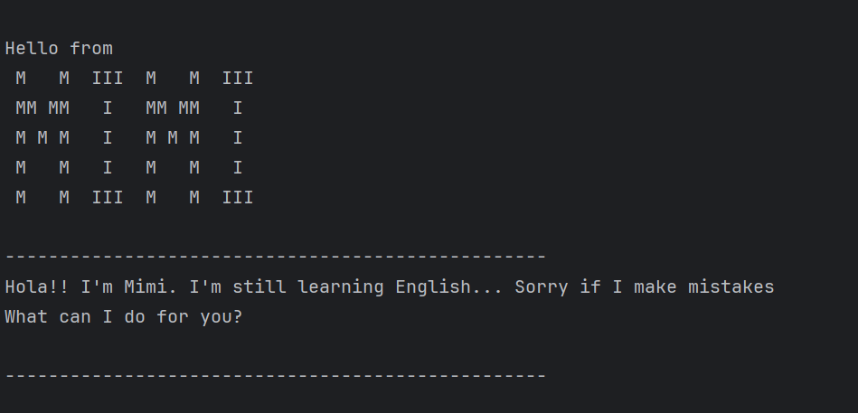

# Mimi User Guide

## 1. Introduction

Welcome to Mimi! This guide will help you get started with managing your tasks using our intelligent chatbot. Whether you’re adding a new task, updating an existing one, or checking your task list, this guide has you covered.
The main feature for Mimi is that she is bilingual! She is still learning English, because she is originally from Spain, so... be patient with her. 

- **Purpose:** Provide a step-by-step guide to using the chatbot for task management. 
- **Scope:** This guide includes instructions for task addition, deletion, updating, and searching.
- **Audience:** Users looking for a simple and interactive way to manage tasks via chat.

## 2. Quick Start
1. Ensure you have Java 17 or above installed in your Computer.  
- Mac users: Ensure you have the precise JDK version prescribed here.
2. Download the latest `.jar` from [here](https://github.com/noradazaperez/ip/releases)
3. Open a command terminal, cd into the folder you put the jar file in, and use the `java -jar Mimi.jar` command to run the application.

4. Type the command you want to execute.

## 3. Features

### 3.1 Add a task: `add`
Add a task to the tasklist. It can be a toDo, deadline or event. 
#### Deadline 
Adds a deadline to the tasklist.  
Format: `deadline DESCRIPTION /by yyyy-MM-dd [mm:ss]`  
Examples: 
- deadline software engineeering assignment /by 2025-03-20
- deadline exam /by 2003-06-10 18:00

#### Event
Adds an event to the tasklist from one date to another.   
Format: `event DESCRIPTION /from yyyy-MM-dd [mm:ss] /to yyyy-MM-dd [mm:ss]`  
Examples:
- event interview /from 2010-10-10 17:00 /to 2010-10-10 18:00

#### To Do 
Adds a todo task.  
Format: `todo DESCRIPTION`  
Examples:
- todo assignment
- todo go for a run

### 3.2 Delete a task: `delete`
It deletes a task from the list.  
Format: `delete INDEX_LIST`  
Examples:
- delete 1
- delete 2

### 3.3. Find a task: `find`
If you enter a keyword, it returns a list with all the tasks that have that keyword.  
Format: `find KEYWORD`  
Examples:
- find todo
- find assignment

### 3.4. Show the list of tasks: `list`
It shows all the current tasks.  
Format: `list`  
Examples:
- list

### 3.5. Mark task as done: `mark`
It marks a task as done.  
Format: `mark INDEX_LIST`  
Examples:
- mark 1

### 3.6. Mark task as undone: `unmark`
It marks a task as undone.  
Format: `unmark INDEX_LIST`  
Examples:
- unmark 1

### 3.7. Exit chatbot: `exit`
It exits the chatbot.  
Format: `exit`

## 4. FAQ
